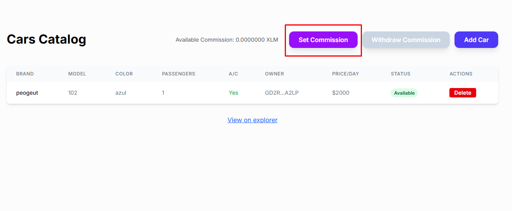
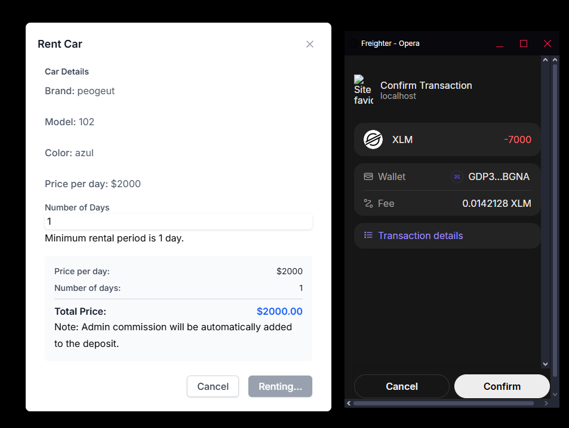
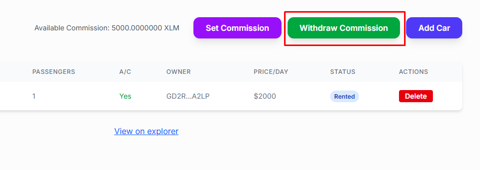

# Rent-a-Car dApp - Stellar Soroban Smart Contract


> Aplicación descentralizada (dApp) para el alquiler de vehículos construida sobre la red Stellar utilizando contratos inteligentes de Soroban. Este proyecto implementa un sistema completo de gestión de alquiler de autos con roles de administrador, propietarios y arrendatarios.


---

## Tabla de contenidos

- [Descripción del proyecto](#descripción-del-proyecto)
- [Últimas características](#últimas-características)
- [Características principales](#características-principales)
- [Requisitos](#requisitos)
- [Instalación](#instalación)
- [Uso](#uso)
- [Arquitectura del contrato](#arquitectura-del-contrato)
- [Funcionalidades implementadas](#funcionalidades-implementadas)
- [Estructura del proyecto](#estructura-del-proyecto)
- [Testing](#testing)
- [Tecnologías utilizadas](#tecnologías-utilizadas)

---

## Descripción del proyecto

Esta aplicación permite gestionar el alquiler de vehículos de forma descentralizada utilizando la tecnología blockchain de Stellar.

Los usuarios pueden:

| Rol | Funcionalidades |
|-----|----------------|
| **Administradores** | Configurar comisiones, gestionar vehículos y retirar ganancias |
| **Propietarios** | Agregar vehículos al catálogo, recibir pagos por alquileres |
| **Arrendatarios** | Explorar vehículos disponibles, alquilar y devolver autos |

---

## Otras características implementadas

### Mejoras en experiencia de usuario

<details>
<summary><strong>Sistema de notificaciones toast</strong></summary>

Reemplazo de alerts por toast notifications no bloqueantes para mejor feedback visual. Todas las operaciones muestran mensajes claros de éxito o error sin interrumpir el flujo del usuario.

</details>

<details>
<summary><strong>Manejo robusto de errores</strong></summary>

Sistema completo de mapeo de errores de Stellar con mensajes descriptivos en español. El sistema detecta automáticamente el tipo de error y presenta mensajes claros al usuario.

</details>

<details>
<summary><strong>Validación de transacciones</strong></summary>

Todas las operaciones validan el éxito de las transacciones antes de actualizar el estado de la aplicación. Esto previene inconsistencias y garantiza que la interfaz refleje el estado real del blockchain.

</details>

<details>
<summary><strong>Prevención de ejecuciones duplicadas</strong></summary>

Protección contra doble-clic y ejecuciones simultáneas con flags de estado. Los botones se deshabilitan automáticamente durante las operaciones para evitar transacciones duplicadas.

</details>

<details>
<summary><strong>Campos numéricos intuitivos</strong></summary>

Ahora puedes borrar completamente los campos y escribir desde cero sin problemas. Los campos usan valores string internamente, permitiendo una edición fluida y natural.

</details>

<details>
<summary><strong>Botones inteligentes</strong></summary>

Se deshabilitan automáticamente durante operaciones y cuando no hay fondos disponibles. Muestran estados de carga claros (ej: "Renting...", "Deleting...") para feedback inmediato.

</details>

### Mejoras en seguridad y confiabilidad

- **Validación en tiempo real**: Los botones se deshabilitan cuando los valores no son válidos
- **Manejo de errores de red**: Mensajes claros cuando las transacciones fallan
- **Estado sincronizado**: El estado de la aplicación solo se actualiza después de confirmar que la transacción fue exitosa

---

## Recomendación para desarrollo y pruebas

> **IMPORTANTE**: Por comodidad al probar la aplicación, **recomiendo crear 3 cuentas diferentes en Freighter** y mantenerlas conectadas simultáneamente.

**Wallets recomendadas:**

- **Wallet de Administrador**: Para configurar comisiones y gestionar vehículos
- **Wallet de Owner**: Para agregar vehículos y recibir pagos por alquileres
- **Wallet de Renter**: Para alquilar y devolver vehículos


---

## Características principales

### Comisión del administrador

El Administrador puede configurar una comisión monetaria fija por cada alquiler. Esta comisión se suma automáticamente al depósito que paga el arrendatario, garantizando ingresos para la plataforma.

**Funcionalidades:**

- *Configuración de comisión por el Administrador*
- *Comisión automática en cada alquiler*
- *Retiro de comisiones acumuladas en cualquier momento*
- *Consulta de comisión disponible para retiro*



---

### Depósito + comisión

Al alquilar un vehículo, la comisión configurada se suma automáticamente al depósito total. El Owner recibe el 100% del monto del alquiler (sin deducción de comisión), mientras que el Administrador acumula la comisión configurada.

**Características:**

- *Cálculo automático: `Depósito Total = Monto Alquiler + Comisión`*
- *El Owner recibe el monto completo del alquiler*
- *La comisión se acumula en la cuenta del Administrador*



---

### Retiro de fondos del administrador

El Administrador puede consultar y retirar las comisiones acumuladas en cualquier momento a través de una interfaz intuitiva.

**Funcionalidades:**

- *Visualización de comisión disponible en tiempo real*
- *Modal para retirar comisiones*
- *Validación de fondos disponibles*
- *Botón deshabilitado cuando no hay fondos disponibles*



---

### Retornos de autos

Los arrendatarios pueden devolver los vehículos que han alquilado, cambiando el estado del vehículo de "Rented" a "Available".

**Funcionalidades:**

- *Botón "Return" visible para arrendatarios en vehículos alquilados*
- *Cambio automático de estado del vehículo*
- *Actualización en tiempo real del catálogo*


---

### Retiros de owners restringidos

Los propietarios solo pueden retirar sus fondos cuando el vehículo ha sido devuelto (estado "Available"). El botón de retiro está deshabilitado si:

- El vehículo está alquilado (estado "Rented")
- No hay fondos disponibles para retirar

**Funcionalidades:**

- *Validación en el contrato: solo permite retiro si el auto está disponible*
- *Botón "Withdraw" visible únicamente cuando hay fondos disponibles*
- *Modal para especificar monto a retirar*
- *Visualización de fondos disponibles en tiempo real*


---

## Requisitos

Antes de instalar y ejecutar el proyecto, asegúrate de tener instalado:

| Herramienta | Descripción | Enlace |
|-------------|-------------|--------|
| **Rust** | Lenguaje de programación (última versión estable) | [Instalar Rust](https://www.rust-lang.org/tools/install) |
| **Cargo** | Gestor de paquetes de Rust (incluido con Rust) | - |
| **Target de Rust para Soroban** | Target necesario para compilar contratos | [Guía de Soroban](https://developers.stellar.org/docs/build/smart-contracts/getting-started/setup) |
| **Node.js** | Runtime de JavaScript (v22 o superior) | [Instalar Node.js](https://nodejs.org/en/download/package-manager) |
| **npm** | Gestor de paquetes de Node.js (incluido con Node.js) | - |
| **Stellar CLI** | Herramienta de línea de comandos de Stellar | [Stellar CLI](https://github.com/stellar/stellar-core) |
| **Scaffold Stellar CLI Plugin** | Plugin para desarrollo de dApps | [Scaffold Stellar](https://github.com/AhaLabs/scaffold-stellar) |

> **Nota importante**: Todas estas herramientas son necesarias para desarrollar y desplegar el proyecto. Asegúrate de tenerlas instaladas antes de continuar.

---

## Instalación

### 1. Clonar el repositorio

```bash
git clone <tu-repositorio>
cd stellar0dApp
```

---

### 2. Configurar variables de entorno

```bash
cp .env.example .env
```

**Importante:** Edita el archivo `.env` con tus configuraciones de red y contratos antes de continuar.

---

### 3. Instalar dependencias del frontend

```bash
npm install
```

---

### 4. Instalar dependencias de los contratos

```bash
npm run install:contracts
```

---

### 5. Compilar el contrato

```bash
cd contracts/rent-a-car
cargo build --target wasm32-unknown-unknown --release
```

> **Nota**: Este paso puede tardar varios minutos la primera vez que se ejecuta.

---

## Uso

### Modo desarrollo

Para ejecutar el proyecto en modo desarrollo:

```bash
npm run dev
```

**Lo que se inicia:**

- *El servidor de desarrollo de Vite*
- *El watcher de Scaffold Stellar para reconstruir los clientes del contrato*

Abre tu navegador en la URL que se muestra en la consola (generalmente `http://localhost:5173`).

---

### Compilar para producción

```bash
npm run build
```

---

### Preview de producción

```bash
npm run preview
```

---

## Arquitectura del contrato

### Estructura de datos

El contrato utiliza las siguientes estructuras principales:

#### Car (Vehículo)

```rust
pub struct Car {
    pub car_status: CarStatus,
    pub available_to_withdraw: i128,
}
```

**Campos importantes:**

- `car_status`: Estado actual del vehículo
- `available_to_withdraw`: Monto disponible para retiro por el owner

---

#### Rental (Alquiler)

```rust
pub struct Rental {
    pub total_days_to_rent: u32,
    pub amount: i128,
}
```

**Campos importantes:**

- `total_days_to_rent`: Días totales del alquiler
- `amount`: Monto del alquiler (en stroops)

---

#### CarStatus (Estado del vehículo)

| Estado | Descripción |
|--------|-------------|
| `Available` | Disponible para alquilar |
| `Rented` | Actualmente alquilado |
| `Maintenance` | En mantenimiento |

---

### Funciones del contrato

#### Funciones públicas (cualquiera puede llamar)

Estas funciones no requieren autenticación y pueden ser llamadas por cualquier usuario:

| Función | Descripción |
|---------|-------------|
| `get_car_status(owner)` | Obtiene el estado de un vehículo |
| `get_admin_available_to_withdraw()` | Obtiene la comisión disponible del Admin |
| `get_owner_available_to_withdraw(owner)` | Obtiene los fondos disponibles del Owner |

---

#### Funciones de administrador

Requieren autenticación del administrador:

| Función | Descripción |
|---------|-------------|
| `set_admin_commission(commission)` | Configura la comisión del Administrador |
| `withdraw_admin_commission(amount)` | Retira comisiones acumuladas |
| `remove_car(owner)` | Elimina un vehículo del catálogo |

---

#### Funciones de owner

Requieren autenticación del propietario:

| Función | Descripción |
|---------|-------------|
| `add_car(owner, price_per_day)` | Agrega un vehículo al catálogo |
| `payout_owner(owner, amount)` | Retira fondos (solo si el auto está disponible) |

---

#### Funciones de renter

Requieren autenticación del arrendatario:

| Función | Descripción |
|---------|-------------|
| `rental(renter, owner, total_days_to_rent, amount)` | Alquila un vehículo |
| `return_car(renter, owner)` | Devuelve un vehículo alquilado |

---

## Funcionalidades implementadas

El proyecto incluye todas las funcionalidades principales para la gestión completa del alquiler de vehículos:

* **Gestión de vehículos**: Agregar y eliminar vehículos del catálogo, consulta de estados en tiempo real
* **Sistema de alquiler**: Alquiler por días con cálculo automático de precios y validación de disponibilidad
* **Sistema de comisiones**: Configuración de comisiones, acumulación automática y retiro de ganancias por el Administrador
* **Devolución de vehículos**: Los arrendatarios pueden devolver vehículos, cambiando su estado automáticamente
* **Gestión de fondos**: Retiros restringidos para Owners (solo cuando el auto está disponible), visualización de fondos en tiempo real
* **Interfaz de usuario**: Dashboard por roles, modales intuitivos, validación de formularios, manejo robusto de errores y notificaciones toast

---

## Estructura del proyecto

```
stellar0dApp/
├── contracts/
│   └── rent-a-car/
│       ├── src/
│       │   ├── contract.rs              # Implementación principal del contrato
│       │   ├── interfaces/
│       │   │   └── contract.rs          # Interfaz del contrato
│       │   ├── storage/
│       │   │   ├── admin.rs              # Funciones de almacenamiento del Admin
│       │   │   ├── car.rs                # Funciones de almacenamiento de autos
│       │   │   ├── rental.rs             # Funciones de almacenamiento de alquileres
│       │   │   └── structs/
│       │   │       ├── car.rs            # Estructura de datos Car
│       │   │       └── rental.rs         # Estructura de datos Rental
│       │   ├── methods/
│       │   │   ├── admin/                # Métodos del administrador
│       │   │   ├── owner/                # Métodos del propietario
│       │   │   ├── renter/               # Métodos del arrendatario
│       │   │   └── public/               # Métodos públicos (consultas)
│       │   ├── events/                   # Definición de eventos
│       │   └── tests/                    # Tests unitarios del contrato
│       └── Cargo.toml
├── src/
│   ├── components/
│   │   ├── CarList.tsx                   # Lista de vehículos
│   │   ├── CreateCarForm.tsx             # Formulario para agregar vehículos
│   │   ├── RentCarModal.tsx              # Modal para alquilar
│   │   ├── SetCommissionModal.tsx        # Modal para configurar comisión
│   │   ├── WithdrawCommissionModal.tsx   # Modal para retirar comisión
│   │   └── WithdrawOwnerModal.tsx        # Modal para retiro de Owner
│   ├── pages/
│   │   ├── Dashboard.tsx                 # Dashboard principal
│   │   ├── RoleSelection.tsx             # Selección de rol
│   │   └── ConnectWallet.tsx              # Conexión de wallet
│   ├── services/
│   │   ├── stellar.service.ts            # Servicio para interactuar con Stellar
│   │   └── wallet.service.ts             # Servicio para manejo de wallets
│   ├── providers/
│   │   └── StellarAccountProvider.tsx    # Context provider para cuentas
│   └── interfaces/                        # Definiciones TypeScript
├── package.json
├── environments.toml
└── README.md
```

---

## Testing

El proyecto incluye una suite completa de tests unitarios para el contrato inteligente.

### Ejecutar tests del contrato

```bash
cd contracts/rent-a-car
cargo test --lib
```

> **Tip**: Puedes ejecutar tests específicos usando `cargo test --lib <nombre_del_test>`

---

### Tests implementados

#### Tests de administración

*Funciones administrativas*

- `test_set_admin_commission_successfully`
- `test_withdraw_admin_commission_successfully`
- `test_get_admin_available_to_withdraw_after_rental`

---

#### Tests de vehículos

*Gestión del catálogo de vehículos*

- `test_add_car_successfully`
- `test_remove_car_deletes_from_storage`
- `test_get_car_status_returns_available`

---

#### Tests de alquiler

*Proceso de alquiler y devolución*

- `test_rental_car_successfully`
- `test_rental_with_admin_commission`
- `test_return_car_successfully`

---

#### Tests de retiros

*Validación de retiros de fondos*

- `test_payout_owner_successfully`
- `test_payout_owner_when_car_is_rented_fails`
- `test_get_owner_available_to_withdraw_car_available_with_funds`

---

#### Tests de autenticación

*Seguridad y permisos*

- Tests para verificar que solo usuarios autorizados pueden ejecutar funciones específicas

---

## Tecnologías utilizadas

**Backend (Smart Contract):**
- *Rust* con *Soroban SDK* para contratos inteligentes en Stellar
- *Stellar XDR* para serialización de datos

**Frontend:**
- *React 19* con *TypeScript* para la interfaz de usuario
- *Vite* como build tool y dev server
- *Stellar SDK* y *Stellar Wallets Kit* para integración con wallets (Freighter)

**Herramientas de desarrollo:**
- *Scaffold Stellar* como framework base
- *Cargo* y *npm* para gestión de dependencias

**Red:**
- *Testnet de Stellar* para pruebas y desarrollo

---

## Autor

**Rodion Romanovich**

---

## Agradecimientos

- **Núcleo** - Por la oportunidad de realizar el bootcamp
- **Comunidad de Stellar** - Por la documentación y herramientas y ser una tecnologia tan divertida
- **Javeblockchain** - Porque no crei conocer gente tan maravillosa 

---
